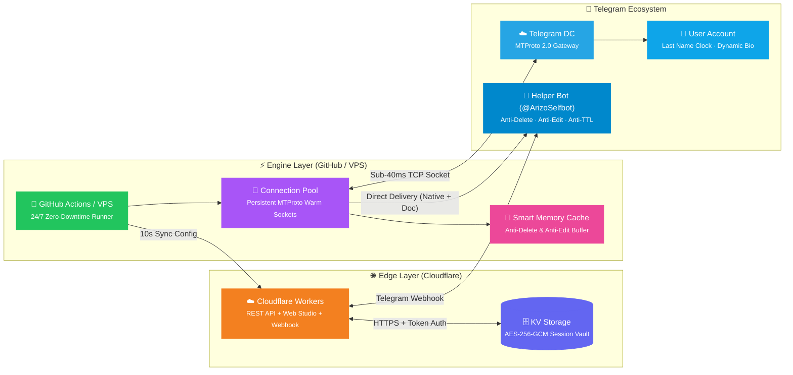

<div align="center">

<br>


<br>

<h3>🔮 پلتفرم نسل جدید سلف‌بات، لاگر هوشمند و استودیوی تلگرام</h3>
<h4><i>Next-Gen Telegram Profile Engine, Edge Helper Bot & Logger Studio with Sub-40ms MTProto Precision</i></h4>

<br>

<a href="https://github.com/ArizoOwner/arizo-runner/actions"></a>
<a href="#"></a>
<a href="#"></a>
<a href="#"></a>

<br><br>

<a href="https://workers.cloudflare.com/"></a>


<br><br>

</div>

---

<div align="center">

### 「 ✦ ویژگی‌های برجسته نسخه ۳.۵ پرو ✦ 」

</div>

<table>
<tr>
<td width="50%">

### ⏱️ &nbsp; موتور ساعت اتمی سلف
**Sub-100ms Atomic Clock Engine**

> الگوریتم هوشمند **Drift-Free** با سوکت‌های زنده و گرم در حافظه  
> پینگ و سرعت ثبت واقعی: **۲۰ الی ۴۰ میلی‌ثانیه**

- 🎯 تنظیم فوق‌دقیق رأس دقیقه `00.000` بدون عقب‌افتادگی
- 🔥 Pre-fetch و آماده‌سازی سوکت ۲ ثانیه قبل از رأس دقیقه
- 🎨 بیش از ۱۰ استایل فونت فانتزی ارقام (`𝟎𝟏۲` · `𝟬𝟭𝟮` · `۰۱۲`)
- 🕐 پشتیبانی کامل از فرمت‌های ۱۲ و ۲۴ ساعته + پیشوند و پسوند

</td>
<td width="50%">

### 🤖 &nbsp; ربات اختصاصی و لاگر هوشمند
**Telegram Helper Bot & Real-Time Logger**

> دستیار تلگرامی شخصی با وب‌هوک پرسرعت کلادفلر  
> گزارش‌گیری و فرماندهی کامل بدون نیاز به باز کردن سایت

- ⚡ ورود مستقیم یک‌کلیکه به استودیو از داخل تلگرام (**Mini App**)
- 📊 استعلام زنده وضعیت و روشن/خاموش سلف با دکمه‌های شیشه‌ای
- 🧪 دستور آزمایشی `/test` جهت بررسی آنی دریافت گزارش‌ها و رسانه
- 🔌 امکان قطع اتصال امن و آزادسازی فوری حافظه Cloudflare KV

</td>
</tr>
<tr>
<td width="50%">

### 📸 &nbsp; نجات‌دهنده رسانه‌های زمان‌دار
**4-Tier Bulletproof Anti-TTL Saver**

> شکار، دانلود ایمن و فوروارد رسانه‌های خودتخریبی  
> قبل از نابودی تایمر، مستقیماً به پیوی ربات اختصاصی

- 🛡️ تشخیص انواع تایمرهای ثانیه‌ای، روزانه و یک‌بار مصرف (**View-Once**)
- 🖼️ استخراج بی‌نقص عکس، فیلم، ویس و ویدیو مسیج دایره‌ای
- 🚀 تحویل تضمینی ۴ لایه به ربات تلگرام با تطبیق دقیق MIME
- 💾 فال‌بک پشتیبان به Saved Messages در صورت مسدود بودن ربات

</td>
<td width="50%">

### 🗑️ &nbsp; سطل زباله و ضد حذف پیام
**Private Anti-Delete Monitor**

> مانیتورینگ بلادرنگ پیام‌های پاک شده در گفتگوهای خصوصی  
> همراه با مشخصات کامل فرستنده و محتوا

- 🔍 کش فوق‌سبک در حافظه رانر بدون اشغال دیتابیس
- 👤 استخراج نام، یوزرنیم، آیدی عددی و زمان دقیق ارسال پیام
- 📝 بازیابی کامل متن پیام و رسانه‌های پیوست‌شده زیر ۴ مگابایت
- 🛡️ نادیده گرفتن خودکار پیام‌های حذف‌شده ناشی از فیلتر سکوت

</td>
</tr>
<tr>
<td width="50%">

### ✏️ &nbsp; ضد ویرایش و مانیتورینگ تغییرات
**Live Anti-Edit Monitor**

> رهگیری آنی متن‌های ویرایش‌شده در چت‌های خصوصی  
> نمایش شفاف تغییرات متن قبل و بعد از ویرایش

- ⚡ رهگیری مستقیم از آپدیت‌های خام MTProto تلگرام
- 🕒 ثبت دقیق لحظه و تاریخ ویرایش متن فرستنده
- ⏮️ تفکیک بصری متن اولیه و متن جدید با نقل‌قول‌های شیک
- 🔔 ارسال آنی هشدار ویرایش به چت اختصاصی شما در ربات

</td>
<td width="50%">

### 🔇 &nbsp; فیلتر سکوت و حذف دوطرفه
**Instant Two-Way Mute Filter**

> سایلنت کردن و حذف قطعی پیام‌های افراد مزاحم  
> در کسری از ثانیه بر اساس آیدی یا یوزرنیم

- 🗑️ حذف دوطرفه بلادرنگ با پرچم `revoke: true`
- 🔢 پشتیبانی از ارقام فارسی و انگلیسی به صورت خودکار
- ⌨️ دستورات سریع تلگرامی `.mute` و `.unmute` در متن پیام
- 👻 بازیابی خودکار AccessHash برای اشخاص ناشناس خارج از مخاطبین

</td>
</tr>
<tr>
<td width="50%">

### 🤖 &nbsp; منشی خودکار پیوی
**AFK Auto-Secretary**

> پاسخگویی هوشمند ۲۴ ساعته در زمان عدم حضور شما  
> مجهز به سیستم کول‌داون ضد اسپم و ضد لیمیت

- 💬 امکان شخصی‌سازی کامل متن پاسخ منشی
- ⏰ زمان‌بندی وقفه (Cooldown) از ۱ دقیقه تا ۲۴ ساعت
- 🚫 فیلتر هوشمند اکانت‌های رسمی تلگرام و ربات‌ها
- 🔄 ارسال امن چندمرحله‌ای برای جلوگیری از خطاهای شبکه

</td>
<td width="50%">

### 📝 &nbsp; بیوگرافی زنده و حالت خواب
**Dynamic Bio Engine & Smart Sleep**

> ساعت و تاریخ هجری خورشیدی در بیوگرافی  
> همراه با اتوماسیون شبانه صرفه‌جویی منابع

- 📅 متغیرهای `{time}`، `{date}` و `{day}` با تقویم شمسی
- 📐 بهینه‌سازی خودکار برای سقف ۷۰ کاراکتر بیو تلگرام
- 🌙 تعیین ساعات خواب شبانه جهت درج استاتوس دلخواه
- ⚡ توقف هوشمند ارسال ریکوئست در زمان خواب اکانت

</td>
</tr>
</table>

---

<div align="center">

### 「 ✦ معماری سامانه (System Architecture) ✦ 」

</div>



---

<div align="center">

### 「 ✦ استودیوی وب نئو-گلاسمورفیسم (Web Studio) ✦ 」

</div>

<table>
<tr>
<td align="center">💎<br><b>طراحی شیشه‌ای نئو</b><br><sub>Glassmorphism & Depth</sub></td>
<td align="center">📱<br><b>ریسپانسیو ۱۰۰٪</b><br><sub>Mobile & Desktop Ready</sub></td>
<td align="center">🌓<br><b>تم‌های نوری دوگانه</b><br><sub>Dark / Light Aurora Modes</sub></td>
<td align="center">⚡<br><b>فیزیک فنری کنترل‌ها</b><br><sub>Spring Physics & Haptics</sub></td>
<td align="center">🚀<br><b>ذخیره و اعمال آنی</b><br><sub>Instant Profile Sync</sub></td>
</tr>
</table>

---

<div align="center">

### 「 ✦ امنیت، حریم خصوصی و تفکیک دسترسی ✦ 」

</div>

<table>
<tr>
<td width="25%" align="center">
<h3>🔐</h3>
<b>AES-256-GCM</b><br>
<sub>رمزنگاری سطح نظامی سشن‌های تلگرام و کلیدهای ورود</sub>
</td>
<td width="25%" align="center">
<h3>🔒</h3>
<b>Exclusive Owner Lock</b><br>
<sub>قفل انحصاری ربات به مالک؛ مسدودسازی دسترسی افراد ناشناس</sub>
</td>
<td width="25%" align="center">
<h3>⚡</h3>
<b>Zero-KV-Write</b><br>
<sub>بهینه‌سازی حداکثری کوئری‌ها بدون مصرف سهمیه دیتابیس در کارکرد عادی</sub>
</td>
<td width="25%" align="center">
<h3>🛡️</h3>
<b>Multi-Tier Fallback</b><br>
<sub>ذخیره تضمینی رسانه‌ها در پیام‌های ذخیره‌شده حتی در صورت مسدودی ربات</sub>
</td>
</tr>
</table>

---

<div align="center">

### 「 ✦ متغیرهای محیطی و پیکربندی ✦ 」

</div>

> **مسیر تنظیم:** &nbsp; Repository → Settings → Secrets and variables → Actions

| نشانگر | متغیر (Variable / Secret) | توضیحات | الزامی |
|:---:|:---|:---|:---:|
| 🌐 | `CLOUDFLARE_URL` | آدرس دامنه ورکر کلادفلر شما — `https://example.workers.dev` | ✅ |
| 🔑 | `RUNNER_SECRET` | کلید احراز هویت امنیتی میان رانر و ورکر | ✅ |
| 📱 | `API_ID` | شناسه رسمی اپلیکیشن تلگرام — پیش‌فرض: `2040` (دسکتاپ) | ⚪ |
| 🔒 | `API_HASH` | هش کلاینت رسمی تلگرام دسکتاپ | ⚪ |
| 🔄 | `GITHUB_TOKEN` | توکن دسترسی گیت‌هاب با مجوز `workflow` جهت تداوم ۲۴ ساعته چرخه | ✅ |

---

<div align="center">

### 「 ✦ راه‌اندازی سریع و آسان (Quick Start) ✦ 」

</div>

#### ☁️ &nbsp; روش ۱: استقرار رایگان و مداوم روی GitHub Actions (توصیه‌شده)

1. مخزن را فورک یا کلون کنید.
2. ورکر کلادفلر را با دستور `npx wrangler deploy` مستقر کنید.
3. متغیرهای جدول بالا را در بخش Secrets گیت‌هاب وارد نمایید.
4. وارد تب **Actions** شوید و چرخه `⚡ Telegram Clock Engine` را استارت کنید:
```text
Repository → Actions → ⚡ Telegram Clock Engine → Run workflow
```
> 🔄 موتور سلف‌بات با اتمام هر اجرا، جاب بعدی را به صورت خودکار احضار می‌کند و چرخه‌ای کاملاً بی‌پایان، رایگان و بدون خاموشی می‌سازد.

#### 🤖 &nbsp; فعال‌سازی ربات و لاگر هوشمند تلگرام

1. از طریق ربات **[@BotFather](https://t.me/BotFather)** تلگرام با دستور `/newbot` یک ربات جدید بسازید.
2. توکن ارائه‌شده (شبیه `123456789:ABC...`) را کپی کنید.
3. در داشبورد Arizo وارد بخش **«⚡ ربات و لاگر»** شوید، توکن را درج کرده و روی **«اتصال و فعال‌سازی وب‌هوک»** بزنید.
4. وارد ربات خود شوید و دکمه **Start** را بزنید تا دستیار اختصاصی شما آماده به کار شود!

#### 💻 &nbsp; روش ۲: اجرای محلی یا روی سرور اختصاصی (VPS) با PM2

```bash
# ۱. نصب پکیج‌ها
npm install --production

# ۲. تعریف متغیرهای محیطی
export CLOUDFLARE_URL="https://your-worker.workers.dev"
export RUNNER_SECRET="your_secret_password"

# ۳. اجرای دائمی پردازش با PM2
pm2 start scripts/github-runner.js --name arizo-runner
pm2 save && pm2 startup
```

---

<div align="center">

### 「 ✦ تکنولوژی‌های استفاده‌شده (Tech Stack) ✦ 」

<br>


<br><br>

| لایه | تکنولوژی | نقش و کاربرد |
|:---:|:---|:---|
| 🌐 | **Cloudflare Workers** | پردازش لبه (Edge Computing)، وب‌هوک تلگرام، Web Studio |
| 🗄️ | **Workers KV** | ذخیره‌سازی ابری سشن‌ها با رمزنگاری پیشرفته AES-256-GCM |
| ⚡ | **GitHub Actions** | موتور رانر ۲۴ ساعته سوکت‌های گرم با پینگ زیر ۴۰ میلی‌ثانیه |
| 📡 | **GramJS (MTProto 2.0)** | کلاینت رسمی پروتکل تلگرام جهت دریافت بلادرنگ آپدیت‌ها |
| 🤖 | **Telegram Bot API** | مینی‌اپ وب (Telegram Mini App) و ارسال اعلان‌های لاگر |
| 🎨 | **Vanilla CSS + Glassmorphism** | رابط کاربری لوکس شیشه‌ای با واکنش‌گرایی کامل موبایل و کامپیوتر |

<br>

---

<br>


<br>

<samp>

**Arizo Self Engine v3.5 PRO** — مهندسی شده برای بیشترین سرعت، پایداری و زیبایی 💎

*Engineered with precision for maximum speed, bulletproof stability & pure aesthetics*

Made with ❤️ by **Arizo Team**

</samp>

</div>
