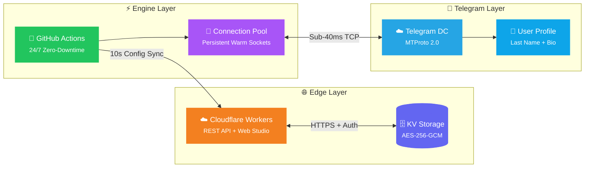

<div align="center">

<br>


<br>

<h3>🔮 پلتفرم نسل جدید سلف‌بات تلگرام و موتور پروفایل اتمی</h3>
<h4><i>Next-Gen Telegram Profile Engine & Edge Selfbot Studio with Sub-100ms MTProto Precision</i></h4>

<br>

<a href="https://github.com/ArizoOwner/arizo-runner/actions"></a>
<a href="#"></a>
<a href="#"></a>
<a href="#"></a>

<br><br>

<a href="https://workers.cloudflare.com/"></a>


<br><br>

</div>

---

<div align="center">

### 「 ✦ Feature Highlights ✦ 」

</div>

<table>
<tr>
<td width="50%">

### ⏱️ &nbsp; موتور ساعت اتمی
**Sub-100ms Atomic Clock Engine**

> الگوریتم **Drift-Free** با سوکت‌های زنده در حافظه  
> پینگ واقعی: **۲۰ ∼ ۴۰ میلی‌ثانیه**

- 🎯 تنظیم میلی‌ثانیه‌ای رأس دقیقه `00.000`
- 🔥 Pre-fetch هوشمند ۲ ثانیه قبل از رأس
- 🎨 ارقام فانتزی `𝟎𝟏𝟐` · `𝟬𝟭𝟮` · `０１２`
- 🕐 ساعت ۱۲/۲۴ ساعته + پیشوند و پسوند

</td>
<td width="50%">

### 📸 &nbsp; نجات‌دهنده ۵ لایه
**5-Tier Anti-TTL Media Saver**

> دانلود و ذخیره تضمینی رسانه‌های خودتخریبی  
> حتی پس از اتمام تایمر و View-Once

- 🛡️ بازیابی ۵ لایه با فال‌بک هوشمند
- 📤 ارسال خودکار به Saved Messages
- 👤 استخراج فراداده فرستنده و تایمر
- 🖼️ پشتیبانی از عکس، ویدیو، GIF و ویس

</td>
</tr>
<tr>
<td width="50%">

### 🤖 &nbsp; منشی هوشمند پیوی
**AFK Auto-Secretary**

> پاسخگویی خودکار ۲۴ ساعته در زمان آفلاین  
> با کول‌داون ضد اسپم قابل تنظیم

- 💬 متن پاسخ خودکار سفارشی
- ⏰ کول‌داون: ۵ دقیقه تا ۲۴ ساعت
- 🚫 فیلتر خودکار ربات‌ها و سرویس تلگرام
- 🔄 ارسال چندلایه تضمینی (۴ تلاش پیاپی)

</td>
<td width="50%">

### 🔇 &nbsp; فیلتر سکوت آنی
**Real-Time Mute Filter**

> حذف دوطرفه بلادرنگ پیام‌های مزاحمین  
> بر اساس آیدی عددی یا یوزرنیم

- 🗑️ حذف قطعی و دوطرفه `revoke: true`
- 🔢 تبدیل خودکار ارقام فارسی `۰-۹` ← `0-9`
- 👻 شناسایی آنی افراد ناشناس (accessHash)
- ⌨️ دستورات سریع `.mute` و `.unmute`

</td>
</tr>
<tr>
<td width="50%">

### 📝 &nbsp; بیوگرافی هوشمند
**Dynamic Bio Engine**

> رندر بلادرنگ ساعت و تقویم خورشیدی  
> به‌روزرسانی همگام با Last Name

- ⏰ متغیر `{time}` — ساعت زنده با فونت فانتزی
- 📅 متغیر `{date}` — تاریخ هجری خورشیدی
- ☀️ متغیر `{day}` — نام روز هفته فارسی
- 📐 محدودیت خودکار ۷۰ کاراکتر API تلگرام

</td>
<td width="50%">

### 🌙 &nbsp; حالت خواب هوشمند
**Smart Sleep Mode**

> اتوماسیون شبانه با زمان‌بندی هوشمند  
> و جایگزینی متن دلخواه

- 🕐 تنظیم ساعت شروع و پایان خواب
- 💤 متن سفارشی مانند `😴 Sleep`
- ⚡ توقف خودکار آپدیت‌های پروفایل
- 🔄 بازگشت خودکار به ساعت عادی

</td>
</tr>
</table>

---

<div align="center">

### 「 ✦ System Architecture ✦ 」

</div>



---

<div align="center">

### 「 ✦ Glassmorphism Web Studio ✦ 」

</div>

<table>
<tr>
<td align="center">🌌<br><b>ذرات نورانی پویا</b><br><sub>Interactive Particle Canvas</sub></td>
<td align="center">💎<br><b>رابط شیشه‌ای</b><br><sub>Glassmorphism UI</sub></td>
<td align="center">🌓<br><b>تم دوگانه</b><br><sub>Dark / Light Aurora</sub></td>
<td align="center">📱<br><b>ماک‌آپ زنده</b><br><sub>Live Profile Preview</sub></td>
<td align="center">⚡<br><b>ذخیره آنی</b><br><sub>Auto-Save on Change</sub></td>
</tr>
</table>

---

<div align="center">

### 「 ✦ Security & Privacy ✦ 」

</div>

<table>
<tr>
<td width="25%" align="center">
<h3>🔐</h3>
<b>AES-256-GCM</b><br>
<sub>رمزنگاری درجه نظامی<br>سشن‌های تلگرام</sub>
</td>
<td width="25%" align="center">
<h3>🛡️</h3>
<b>Zero Hardcoded</b><br>
<sub>تزریق سکرت‌ها فقط از<br>GitHub Secrets</sub>
</td>
<td width="25%" align="center">
<h3>⚡</h3>
<b>Zero-KV-Write</b><br>
<sub>بدون نوشتن در چرخه‌های<br>عادی و بدون خطا</sub>
</td>
<td width="25%" align="center">
<h3>🛑</h3>
<b>Timing-Safe</b><br>
<sub>مقایسه توکن‌ها در<br>زمان ثابت</sub>
</td>
</tr>
</table>

---

<div align="center">

### 「 ✦ Environment Variables ✦ 」

</div>

> **تنظیم در:** &nbsp; Repository → Settings → Secrets and variables → Actions

| &nbsp; | Variable | Description | Required |
|:---:|:---|:---|:---:|
| 🌐 | `CLOUDFLARE_URL` | آدرس ورکر کلادفلر — `https://example.workers.dev` | ✅ |
| 🔑 | `RUNNER_SECRET` | رمز ارتباطی رانر با ورکر | ✅ |
| 📱 | `API_ID` | شناسه اپلیکیشن تلگرام — پیش‌فرض: `2040` | ⚪ |
| 🔒 | `API_HASH` | هش کلاینت رسمی تلگرام دسکتاپ | ⚪ |
| 🔄 | `GITHUB_TOKEN` | توکن گیت‌هاب با دسترسی `workflow` | ✅ |

---

<div align="center">

### 「 ✦ Quick Start ✦ 」

</div>

#### ☁️ &nbsp; روش ۱: اجرای ۲۴/۷ روی GitHub Actions (رایگان و نامحدود)

```
Repository → Actions → ⚡ Telegram Clock Engine → Run workflow
```

> ✨ ریپازیتوری عمومی است — اکشنز گیت‌هاب **بدون محدودیت زمانی** و کاملاً رایگان کار می‌کند.

#### 💻 &nbsp; روش ۲: اجرا روی VPS با PM2

```bash
# ═══════════════════════════════════════════
#  نصب وابستگی‌ها
# ═══════════════════════════════════════════
npm install --production

# ═══════════════════════════════════════════
#  تنظیم متغیرهای محیطی
# ═══════════════════════════════════════════
export CLOUDFLARE_URL="https://your-worker.workers.dev"
export RUNNER_SECRET="your_secret_password"

# ═══════════════════════════════════════════
#  اجرای دائمی با PM2
# ═══════════════════════════════════════════
pm2 start scripts/github-runner.js --name arizo-runner
pm2 save && pm2 startup
```

---

<div align="center">

### 「 ✦ Tech Stack ✦ 」

<br>


<br><br>

| Layer | Technology | Role |
|:---:|:---|:---|
| 🌐 | **Cloudflare Workers** | Edge API, Web Studio, KV Storage |
| ⚡ | **GitHub Actions** | 24/7 Zero-Downtime Runner Engine |
| 📡 | **GramJS (MTProto 2.0)** | Telegram Client & Push Updates |
| 🔐 | **WebCrypto AES-256-GCM** | Session Encryption & Auth |
| 📱 | **Glassmorphism UI** | Premium Web Dashboard |

<br>

---

<br>


<br>

<samp>

**Arizo Self Engine v3.0** — مهندسی شده برای بیشترین سرعت، پایداری و زیبایی 💎

*Built with precision for speed, stability & aesthetics*

Made with ❤️ by **Arizo Team**

</samp>

</div>
