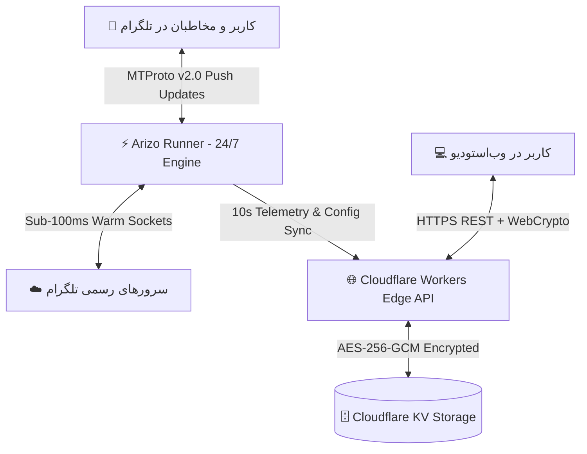

<div align="center">

# ⚡ Arizo Self — Ultra-Fast Sub-100ms Telegram Selfbot

**پلتفرم نسل جدید سلف‌بات تلگرام و موتور پروفایل اتمی با سرعت زیر ۱۰۰ میلی‌ثانیه**  
*Next-Gen Telegram Profile Engine & Edge Selfbot Studio with Sub-100ms MTProto Precision*

---

[](https://github.com/ArizoOwner/arizo-runner/actions)
[](https://workers.cloudflare.com/)
[](https://core.telegram.org/mtproto)
[]()
[](https://nodejs.org/)
[]()

</div>

---

## 🌟 نمای کلی | Overview

**Arizo Self** یک پلتفرم جامع، مدرن و با معماری هایبرید برای مدیریت هوشمند حساب کاربری تلگرام است. این پروژه با ترکیب **Edge Computing کلادفلر (Cloudflare Workers)** برای داشبورد و وب‌استودیو شیشه‌ای، و **استخر اتصالات زنده (Persistent Warm Connection Pool)** روی موتور ۲۴ ساعته گیت‌هاب، سریع‌ترین و پایدارترین تجربه سلف‌بات تلگرام را با پینگ زیر ۴۰ میلی‌ثانیه رقم می‌زند.

---

## 🚀 ویژگی‌های کلیدی | Key Features

### ⏱️ ۱. موتور ساعت اتمی زیر ۱۰۰ میلی‌ثانیه‌ای (Sub-100ms Clock Engine)
- **تنظیم میلی‌ثانیه‌ای رأس دقیقه:** استفاده از الگوریتم Drift-Free بدون کوچک‌ترین خطای زمانی تجمعی.
- **تکنیک Pre-fetch در ثانیه ۵۸:** آماده‌سازی پیش‌دستانه فرمت ساعت ۲ ثانیه زودتر جهت به‌روزرسانی بدون درنگ در رأس ثانیه `00.000`.
- **استخر سوکت زنده (Persistent Warm Socket):** نگه‌داشتن نشست‌ها در حافظه که زمان پاسخ‌دهی را از ۵۰۰ میلی‌ثانیه به **۲۰ الی ۴۰ میلی‌ثانیه** کاهش می‌دهد.
- **پشتیبانی از ارقام فانتزی و ساعت ۱۲/۲۴ ساعته:** همراه با پیشوند، پسوند و جداکننده‌های سفارشی.

### 📝 ۲. بیوگرافی هوشمند و پویا (Dynamic Bio)
- رندر بلادرنگ ساعت، تاریخ هجری خورشیدی دقیق (`{date}`) و روزهای هفته به زبان فارسی (`{day}`).
- به‌روزرسانی هم‌گام با نام خانوادگی در رأس هر دقیقه.

### 🤖 ۳. منشی هوشمند و خودکار پیوی (AFK Auto-Secretary)
- پاسخگویی خودکار و بدون مکث به مخاطبان در زمان آفلاین بودن با متن دلخواه شما.
- **کول‌داون ضد اسپم هوشمند:** جلوگیری از تکرار پاسخ به یک مخاطب در بازه زمانی تعیین‌شده (قابل تنظیم از ۵ دقیقه تا ۲۴ ساعت).
- فیلتر هوشمند پیامک‌های رسمی تلگرام (کدهای ورود) و ربات‌ها.

### 📸 ۴. نجات‌دهنده ۵ لایه مدیاهای زمان‌دار (5-Tier Anti-TTL Saver)
- نجات و فوروارد فوری عکس‌ها و ویدیوهای محوشونده (تایمر ۱ تا ۳۰ ثانیه و View-Once) به بخش **Saved Messages**.
- استخراج فراداده فرستنده، زمان دقیق، ثانیه‌شمار تایمر و فرمت رسانه.
- مکانیزم بازیابی ۵ لایه حتی در صورت اتمام تایمر با استفاده از متدهای Stripped Size و بازخوانی RPC سرور.

### 🔇 ۵. فیلتر سکوت و حذف آنی پیام (Real-Time Mute Filter)
- حذف دوطرفه بلادرنگ پیام‌های ارسالی افراد مزاحم بر اساس **آیدی عددی** یا **یوزرنیم**.
- تبدیل خودکار کاراکترها و اعداد فارسی/عربی (`۰-۹`) به ارقام استاندارد.
- استعلام هویت آنی افراد ناشناس (`accessHash`) در اولین پیام دریافتی.
- دستورات سریع تلگرامی با ارسال `.mute` و `.unmute` در محیط گفت‌وگو.

### 🌙 ۶. حالت خواب و اتوماسیون هوشمند (Smart Sleep Mode)
- قابلیت زمان‌بندی ساعات خواب شبانه جهت غیرفعال‌سازی موقت آپدیت‌ها یا قرار دادن متن استراحت (مانند `😴 Sleep`).

---

## 🎨 طراحی وب‌استودیو شیشه‌ای | Glassmorphism Studio

داشبورد وب اختصاصی Arizo Self با استاندارد طراحی مدرن و جلوه‌های بصری خیره‌کننده طراحی شده است:
- 🌌 **بوم پویا و ذرات نورانی (Interactive Particle Canvas)**
- 💎 **کارت‌های شیشه‌ای Blur & Saturate (Glassmorphism UI)**
- 🌓 **سوئیچینگ آنی تم تاریک و روشن (Dark/Light Aurora Themes)**
- 📱 **ماک‌آپ زنده پروفایل تلگرام با ثانیه‌شمار بلادرنگ**
- ⚡ **ذخیره‌سازی آنی (Auto-Save on Change)** بدون نیاز به رفرش صفحه

---

## 🏗️ معماری سیستم | Architecture Overview



---

## 🔒 امنیت و حریم خصوصی | Enterprise-Grade Security

- 🔐 **رمزنگاری AES-256-GCM:** سشن‌های تلگرام پیش از ذخیره‌سازی با کلید اختصاصی رمزنگاری شده و نشست خام هرگز در دیتابیس ذخیره نمی‌شود.
- 🛡️ **فقدان سکرت‌های هاردکدشده:** متغیرهای حساس منحصراً از طریق **GitHub Secrets** و **Cloudflare Environment Variables** تزریق می‌شوند.
- ⚡ **معماری Zero-KV-Write:** رانر در چرخه‌های بدون خطای خود هیچ درخواست نوشتنی به KV ارسال نمی‌کند تا سقف پلن رایگان کلادفلر همیشه حفظ شود.
- 🛑 **حفاظت Timing-Attack:** بررسی امنیتی توکن‌ها با مقایسه بافرها در زمان ثابت (`timingSafeEqual`).

---

## ⚙️ متغیرهای محیطی | Environment Variables

برای راه‌اندازی رانر، متغیرهای زیر را در بخش **Settings > Secrets and variables > Actions** تعریف فرمایید:

| متغیر | شرح | اجباری |
| :--- | :--- | :---: |
| `CLOUDFLARE_URL` | آدرس دامنه ورکر کلادفلر (مثال: `https://arizo-self.workers.dev`) | ✅ بله |
| `RUNNER_SECRET` | رمز ارتباطی رانر با ورکر کلادفلر (مشابه `ADMIN_PASSWORD`) | ✅ بله |
| `API_ID` | شناسه اپلیکیشن تلگرام (پیش‌فرض: `2040` تلگرام دسکتاپ) | ⚪ اختیاری |
| `API_HASH` | هش کلاینت رسمی تلگرام دسکتاپ | ⚪ اختیاری |
| `GITHUB_TOKEN` | توکن گیت‌هاب با دسترسی `workflow` برای تمدید چرخه ۲۴ ساعته | ✅ بله |

---

## 🚀 استقرار و اجرا | Deployment

### ۱. اجرای ۲۴/۷ روی GitHub Actions (رایگان و نامحدود)
به علت عمومی بودن ریپازیتوری، اکشنز گیت‌هاب بدون هیچ‌گونه محدودیت زمانی (بدون کسر سهمیه ۲۰۰۰ دقیقه) فعال است.
کافیست به تب **Actions** رفته و ورک‌فلو **⚡ Telegram Clock Engine** را با دکمه **Run workflow** استارت بزنید.

### ۲. اجرای محلی یا روی VPS
```bash
# نصب وابستگی‌ها
npm install --production

# اجرای رانر با PM2
export CLOUDFLARE_URL="https://your-worker.workers.dev"
export RUNNER_SECRET="your_secret_password"

pm2 start scripts/github-runner.js --name arizo-runner
pm2 save
```

---

<div align="center">

**Arizo Self Engine** — مهندسی شده برای بیشترین سرعت، پایداری و زیبایی 💎  
*Engineered with precision for speed, stability & aesthetics.*

</div>
